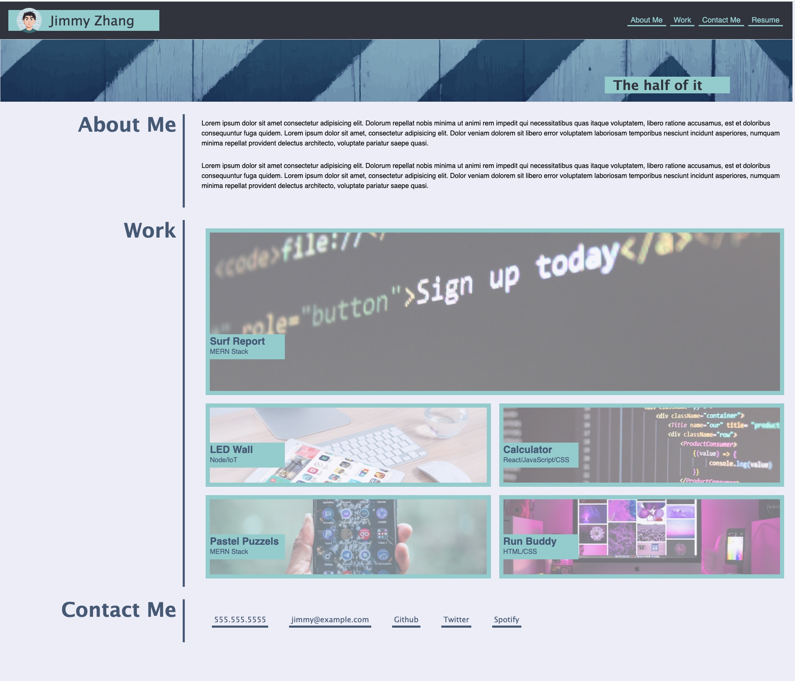

# Bootcamp Module2 Challenge 
author: Ji Zhang  

## application function description

* I tried to 100% copy the mock-up, include the color, layout and behavior.
* The page's max-width is 1900px, min-width is 375px, it would response to the width change.
* The resume link to a fake file resume, the application images link to fake deployed files.
* In the "Contact Me" part:
    * phone number links to tel:phonenumber;
    * email links to mailto:emailaddress;
    * github/twitter/spotify links to those application first page;


## live URL link to deployed application

[The live URL link to deployed application](https://jizhang80.github.io/bootcamp-jz-module2/)

## page screenshot



### task checklist
- [X] portfolio has the developer's name, an avatar, 
- [X] several link types, to sections, works(deployed application) and contact info;
- [X] Links work well;
- [X] the work section has titled images of the developer's application; 
- [X] the first application's image should be larger than the others;
- [X] application image link to deployed application;
- [X] a responsive layout that adapts to my viewport
- [X] when mouse move on work image, turn to hand; (cursor: pointer)

### User Story

```
AS AN employer
I WANT to view a potential employee's deployed portfolio of work samples
SO THAT I can review samples of their work and assess whether they're a good candidate for an open position
```


### Acceptance Criteria

Here are the critical requirements necessary to develop a portfolio that satisfies a typical hiring manager’s needs:

```
GIVEN I need to sample a potential employee's previous work  

WHEN I load their portfolio
THEN I am presented with the developer's name, a recent photo or avatar, and links to sections about them, their work, and how to contact them

WHEN I click one of the links in the navigation
THEN the UI scrolls to the corresponding section

WHEN I click on the link to the section about their work
THEN the UI scrolls to a section with titled images of the developer's applications

WHEN I am presented with the developer's first application
THEN that application's image should be larger in size than the others

WHEN I click on the images of the applications
THEN I am taken to that deployed application

WHEN I resize the page or view the site on various screens and devices
THEN I am presented with a responsive layout that adapts to my viewport
```

## Grading Requirements
### Technical Acceptance Criteria: 40%
Satisfies all of the preceding acceptance criteria.

### Deployment: 32%
Application deployed at live URL.
Application loads with no errors.
Application GitHub URL submitted.
GitHub repository contains application code.

### Application Quality: 15%
Application resembles the mock-up functionality provided in the Challenge instructions.

### Repository Quality: 13%
Repository has a unique name.
Repository follows best practices for file structure and naming conventions.
Repository follows best practices for class/id naming conventions, indentation, quality comments, etc.
Repository contains multiple descriptive commit messages.
Repository contains a quality readme with description, screenshot, link to deployed application.
